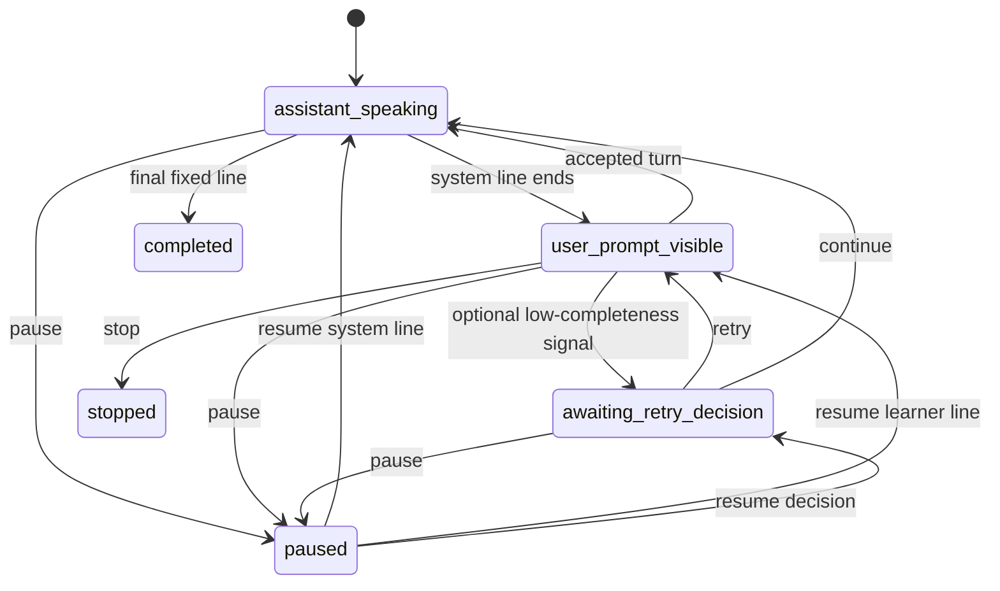

# Guided Conversations v0.2

Release: 0.7.0  
Engine: `guided-engine-v0.2`  
Content: `guided-content-v3`  
Fluency: `fluency-v0.1`

## Product boundary

Guided Conversations is deterministic role-play practice. The learner sees an exact line,
reads it aloud, and hears the next fixed character line. It measures performance while reading
a known script: pronunciation, temporal delivery, completion, retries, and task-specific
self-confidence. It does not measure unrestricted language generation and cannot issue, promote,
or change a CEFR placement.

The placement assessment remains the only authority for `current_cefr_level`. The trusted
application backend supplies the persisted placement level to this service; a browser must never
supply an authoritative level or receive the service credential.

## Domain-first catalog and access policy

The learner first chooses a domain, then a scenario inside that domain. The initial
catalog has `Restaurant` and `Airport` domains:

| Domain | Scenario ID | Required level | Learner turns |
| --- | --- | ---: | ---: |
| Restaurant | `restaurant.order_drink.a1` | A1 | 6 |
| Restaurant | `restaurant.order_meal.a1` | A1 | 6 |
| Restaurant | `restaurant.wrong_order.b1` | B1 | 8 |
| Airport | `airport.check_in.a2` | A2 | 6 |

Scenarios at or below the learner's persisted placement are unlocked. Higher scenarios remain in
catalog responses with `is_locked=true`, but both detailed preview and session creation return HTTP
403. An incomplete placement locks all scenarios.

Content lives in `services/guided_conversation/content`. Each immutable scenario stores its
version, roles, objective, useful vocabulary, fixed system text, exact displayed/expected learner
text, expected pause boundaries, target words, and target phonemes. Run
`python tools/validate_scenarios.py`; `_scenario_schema.json` is the generated JSON Schema.

## Deterministic state machine



At the last turn, accepted or continued progression enters `completed` and plays the scenario's
fixed closing line. All transitions are persisted with optimistic revision checks and audit events.
Attempt POSTs are idempotent. A retry retains earlier attempts but sets only the final attempt for
that turn as `selected`; reports aggregate selected attempts.

ASR transcript similarity is an auxiliary completeness signal only. Below 0.55 completion, the
service may offer at most two retries. The learner can always continue. An ASR mismatch is never a
pronunciation diagnosis and never changes access or placement.

## LiveKit runtime

The existing `english-tutor` worker branches before creating the free-conversation LLM pipeline.
The application backend calls `POST /v1/practice-sessions` with `mode=guided`.
The returned short-lived LiveKit token explicitly dispatches `english-tutor`
with trusted job metadata:

```json
{
  "conversation_mode": "guided",
  "guided_session_id": "guided-7e3..."
}
```

Job metadata is authoritative; pre-existing integrations may use the same JSON
as room metadata during migration. The runtime fetches every fixed line from the service. Its
LiveKit scheduler dependency is a local disabled LLM adapter with no provider, credentials,
network path, or generation method; any unexpected generation attempt raises an error. Normal
guided progression therefore makes no Gemini, OpenAI, or other LLM request.

Character lines use the pinned local Piper 1.6.0 adapter and the pre-downloaded
`en_US-lessac-medium` model. CPU synthesis runs on a thread so inference does not block the async
room loop. Guided TTS has no runtime network call. Free conversation and placement retain their
existing online streaming voices.

The worker publishes UTF-8 JSON on reliable topic `guided.events`:

- `guided.session_ready`
- `guided.learner_prompt_active`
- `guided.turn_evaluated`
- `guided.retry_ready`
- `guided.continued`
- `guided.line_replayed`
- `guided.paused`
- `guided.resumed`
- `guided.completed`
- `guided.stopped`
- `guided.session_closed`
- `guided.error`

The browser publishes `{"command":"..."}` on reliable topic `guided.command`. Supported commands
are `retry`, `continue`, `replay`, `replay_slow`, `pause`, `resume`, and `stop`. Pause persists the
state and disables the browser microphone; resume restores the exact prior state. The backend/API
remains authoritative for state; LiveKit data is a UI notification transport, not a durable record.

Every evaluated turn includes an ephemeral `conversation_turn` event containing the current
assistant line, learner transcript, and word-level STT recognition confidence. The browser keeps
these events in memory to render the complete conversation. Confidence below 25% is red, 25% to
below 75% is orange, and 75% or above is white. These colors debug recognition and must never be
labeled as pronunciation accuracy. The transcript and word rows are not stored in the durable
guided record.

After the fixed closing line finishes, the worker publishes `guided.session_closed`, shuts down the
per-room `AgentSession`, disconnects from the room, and stops accepting STT for that learner. The
shared `english-tutor` worker process remains running to accept later rooms. Completed speech can
therefore never trigger a repeated "conversation is no longer active" response.

## Audio, TTS, and pronunciation

`scripts/setup_piper.ps1` downloads both the voice `.onnx` model and its `.onnx.json`
configuration once. `tools/piper_preflight.py` loads them and performs real local synthesis. With
`PIPER_REQUIRED=true`, the API readiness check reports a missing or unloadable Piper installation.
Full-conversation replay is rendered as `audio/wav` through
`GET /v1/guided-conversations/sessions/{id}/replay-audio`; the browser does not use Web Speech API
voices. Learner lines in the replay are reconstructed from the fixed script and spoken slightly
more slowly by the same Piper voice; original learner audio remains consent-gated.

Piper removes the online TTS dependency only. LiveKit transport and Deepgram Flux STT remain
online services in this architecture.

Enhanced audio feeds Flux for word timing, speech start/end, and the auxiliary transcript. When the
learner grants recording consent, the original pre-enhancement segment is encrypted and stored for
the attempt. Without consent, no raw guided audio is uploaded and pronunciation remains
`not_requested`.

When `PRONUNCIATION_SERVICE_URL` and `PRONUNCIATION_SERVICE_TOKEN` are configured and raw audio is
available, the service posts `guided.pronunciation_requested` to
`POST {PRONUNCIATION_SERVICE_URL}/v1/pronunciation/jobs`. It supplies the known reference text,
target words/phonemes, internal audio URI, stable event ID, and callback URL. The external worker
calls `POST /v1/guided-conversations/pronunciation/callback` with a completed or failed event.

This job is asynchronous. Queue failure, evaluation failure, or a pending result never blocks the
next fixed turn. Deployments using local encrypted storage must give the pronunciation worker a
secure retrieval path; distributed deployments should use the existing encrypted S3 backend or a
separate authorized retrieval broker.

## Guided-speaking fluency and delivery

Each selected turn is sent through the same `fluency-v0.1` feature extractor and scorer used by
assessment and conversation, under isolated mode `guided`. It derives speech/articulation rate,
pause behavior, continuity, repair/disfluency evidence, eligibility, evidence confidence, and the
explainable fluency index. The guided report overrides the interpretation to state that the index
describes this oral-reading scenario; the model validator prohibits CEFR output outside assessment.

Guided oral-reading lines use task-specific evidence gates: two timed words and 0.8 seconds per
line. A session needs at least three eligible guided lines and then either five eligible lines or
eight seconds of eligible learner speech. Free conversation retains its five-word, 2.5-second
per-turn and 30-second session rules; assessment is also unchanged. The internal debug report
retains `result_debug.thresholds` and one `result_debug.lines` row per scenario line with timing
source, timed words, duration, ASR confidence, eligibility, and exact insufficiency reasons. These
fields are available only on the admin route and are not returned to the learner interface.

The internal delivery-stability model separately reports:

- mean prompt-to-speech time;
- expected-line completion ratio;
- mid-phrase versus expected-boundary pauses;
- retry count; and
- turns completed without retry.

The label is `stable`, `developing`, or `needs_more_evidence`. It is observable delivery, not a
claim about psychological confidence. Before and after 0–100 values are stored only as learner
self-report. Neither object appears in the learner result; both remain available to developers in
the admin debug report.

## Learner result versus developer diagnostics

The learner DTO deliberately answers “how did I do, and what should I practise next?” It returns:

- one speaking-flow score and friendly headline;
- completion;
- Pace, Smoothness, and Connected Speech skill cards;
- one strength and one next step;
- up to three real pronunciation tips when the optional phoneme service completed; and
- replay/practise-again actions plus the no-CEFR-change note.

It excludes evidence confidence, eligible-line counts, raw timing, delivery stability,
repair/breakdown terminology, thresholds, line reasons, versions, and internal limitations.
Insufficient evidence produces no numeric score and a friendly request to repeat the scenario.
The admin DTO preserves every former report field for debugging and calibration.

## Privacy and persistence

The durable guided attempt stores a transcript SHA-256, derived fluency/delivery results,
pronunciation state, selected-attempt flag, versions, and optional encrypted audio URI. It does not
store the transcript or word timestamps in the guided session or idempotency replay JSON. Raw
audio follows the existing consent, encryption, retention, and cleanup controls.

SQLite and PostgreSQL schema changes are in migration `003`. Every report retains content, engine,
fluency, delivery, and pronunciation versions so later releases do not reinterpret old sessions.

## API sequence

Normal `/v1` calls require `Authorization: Bearer <ASSESSMENT_SERVICE_TOKEN>` and are made by the
BFF. The `/v1/admin` debug route requires the separate admin token and is never browser-facing.

1. `GET /v1/guided-conversations/domains?placement_completed=true&placement_level=A1`
2. Select a scenario nested inside its domain; optionally preview it through
   `GET /v1/guided-conversations/scenarios/{id}`.
3. `POST /v1/practice-sessions` with `mode=guided` and the selected scenario.
4. BFF returns the supplied short-lived LiveKit token and initial `guided_session`.
5. LiveKit worker calls `prompt-ready`, uploads consented audio, and submits attempts.
6. Browser/BFF posts post-task confidence to `/sessions/{id}/confidence`.
7. The worker closes the room session after the fixed closing line.
8. `GET /v1/practice-sessions/{id}/result?mode=guided` for the learner-facing result.
9. `GET /v1/guided-conversations/sessions/{id}/replay-audio` for local Piper replay.
10. Developers may call
    `GET /v1/admin/guided-conversations/sessions/{id}/debug-report` with the admin token.

The generated request and response schemas are in `docs/api/openapi.yaml`. A browser data-topic
adapter is provided in `examples/frontend/guided-conversation.ts`; a runnable
local browser client is provided in `examples/guided-demo`.

## Calibration boundary

The current score is an explainable MVP baseline, not a calibrated probability or validated human
rating. Before changing thresholds, collect consented sessions, have at least two trained raters
score delivery with a defined rubric, use speaker-independent train/test splits, and publish a new
scorer version. Scenario results may recommend more practice or a placement retake, never level-up
by themselves.
